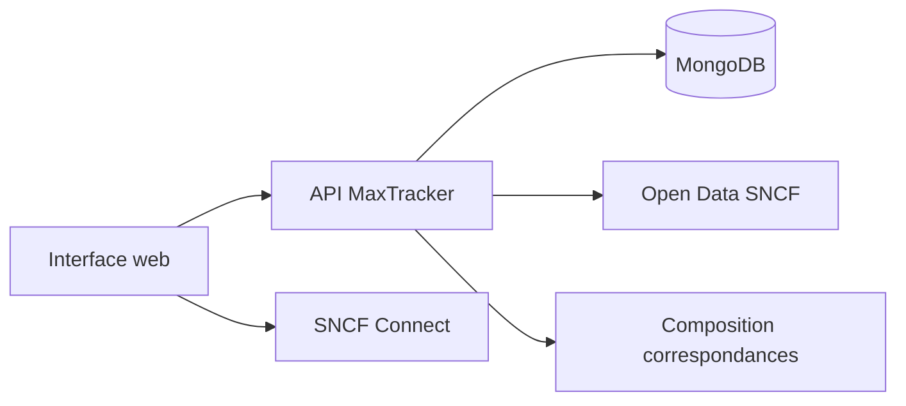

# MaxTracker

**Repérez rapidement les trains TGV Max à 0 €** depuis votre gare de départ, directs ou avec correspondance (TGV INOUI, Intercités, Intercités de nuit), sans parcourir destination par destination sur SNCF Connect.

MaxTracker aide les titulaires d'un abonnement **MAX Jeune ou MAX Senior** (offres TGV Max) à trouver les trajets éligibles à **0 €** sur les **30 prochains jours**.
C'est un service **gratuit, indépendant et non officiel** : il ne vend pas de billets et ne réserve pas à votre place.
Il agrège les données ouvertes SNCF, compose des parcours multi-segments lorsque c'est possible, puis vous **redirige** vers [SNCF Connect](https://www.sncf-connect.com) pour réserver.

---

## Sommaire

- [À quoi ça sert ?](#à-quoi-ça-sert-)
- [Fonctionnalités](#fonctionnalités)
- [Comment l'utiliser](#comment-lutiliser)
- [Ce que vous pouvez faire](#ce-que-vous-pouvez-faire)
- [Bon à savoir](#bon-à-savoir)
- [Avertissement](#avertissement)
- [Pour les développeurs](#pour-les-développeurs)

---

## À quoi ça sert ?

Vous avez un abonnement TGV Max et vous cherchez un trajet à **0 €** dans les **30 prochains jours**, sans passer des heures sur SNCF Connect.
MaxTracker interroge une base alimentée par le jeu ouvert [« Disponibilités TGV Max »](https://data.sncf.com/explore/dataset/tgvmax/) publié par SNCF Voyageurs.

 L'application affiche les **trajets directs** et, lorsque les créneaux s'enchaînent correctement, des **parcours avec correspondance** (jusqu'à 2).

La SNCF publie une nouvelle vague de données **chaque jour en début de matinée** (aux alentours de 6 h 30).
MaxTracker importe ce flux environ **toutes les 15 minutes** : ce n'est pas du temps réel, mais cela permet de rafraîchir la base (trajets éligibles et heures de départ).

Pour le détail des filtres, des parcours composés, des horodatages affichés et des écarts possibles avec SNCF Connect, voir la page **À propos** dans l'application (`#/about`) ou le fichier [front/src/pages/About.jsx](front/src/pages/About.jsx).

---

## Fonctionnalités

- Recherche par gare de départ, résultats groupés par ville d'arrivée
- **Trajets directs** et **parcours avec correspondance** (filtre : direct, 1 ou 2 correspondances)
- **Filtres simples** : type de train, correspondances max
- **Filtres avancés** : horizon de dates (7 / 14 / 30 j, défaut 30 j), créneaux horaires, durée totale max (≤ 3 h / 5 h / 8 h), départ aujourd'hui, et départ week-end uniquement
- Vues **Liste**, **Calendrier** (30 jours) et **Pics horaires**
- Badge **« Départ possible aujourd'hui »**, badge **« Imminent »** (< 4 h)
- Gares **favoris**, **masquage** de destinations, **sync manuelle**
- **Mode clair / sombre** (préférence mémorisée, transition en fondu au basculement)

---

## Comment l'utiliser

1. **Saisissez votre gare de départ** (au moins 3 lettres pour l'autocomplétion)
2. Lancez la recherche
3. Parcourez les résultats **par ville de destination** (trains directs et parcours composés, triés par date)
4. Affinez avec les **filtres** — panneau *Filtres simples* / *Filtres avancés* (ou feuille mobile)
5. Changez de vue : **Liste**, **Calendrier** ou **Pics horaires**
6. Ouvrez **SNCF Connect** depuis chaque train (un lien par segment sur les parcours avec correspondance)

**Astuces**

- **Gares favorites** enregistrées localement dans votre navigateur
- **Masquer** une destination que vous ne voulez plus voir (réversible via « Réafficher tout »)
- **Correspondances max** : *Direct* par défaut ; passez à *1* ou *2* pour voir les parcours composés
- **Horizon de dates** : 30 j par défaut ; réduisez à 7 ou 14 j pour alléger la liste
- **Durée totale max** : utile pour les allers-retours à la journée (porte à porte, attentes incluses)
- Badge **« Départ possible aujourd'hui »** : au moins un départ encore possible aujourd'hui vers cette ville
- Badge **« Imminent »** : départ dans moins de 4 heures
- Le header affiche deux horodatages : dernière publication **SNCF** et dernière importation **MaxTracker**
- Bouton de **sync manuelle** pour forcer un rafraîchissement des données
- Icône **soleil / lune** dans le header : bascule le thème clair / sombre avec un fondu progressif

---

## Ce que vous pouvez faire

| Besoin | Dans l'app |
|--------|------------|
| Voir tous les départs à 0 € depuis une gare | Recherche par gare de départ |
| Comparer les destinations | Liste groupée par ville |
| Ne garder que les trajets directs | Filtre *Correspondances max* → Direct |
| Autoriser 1 ou 2 changements de train | Filtre *Correspondances max* → 1 ou 2 |
| Limiter aux 7 / 14 / 30 prochains jours | Filtre *Horizon de dates* |
| Aller-retour à la journée | Filtre *Durée totale max* |
| Ne garder que les départs du jour | Filtre *Départ aujourd'hui* |
| Cibler le week-end ou un créneau | Filtres week-end et horaires |
| Ne garder que TGV INOUI ou Intercités | Filtres par type de train |
| Planifier sur le mois | Vue calendrier |
| Repérer les meilleures heures | Graphique des pics horaires |
| Réserver | Lien(s) SNCF Connect (par segment si correspondance) |

Si **aucun train éligible** n'apparaît pour votre gare, l'app vous l'indique clairement : les places se libèrent souvent par vagues, réessayez plus tard.

Si la gare n'est **pas desservie** par l'offre TGV Max, un message d'erreur vous le signale.

---

## Bon à savoir

- **Vérifiez toujours sur SNCF Connect** avant de vous déplacer. Un train éligible affiché ici peut avoir été réservé entre deux mises à jour.
- **Fenêtre de 30 jours** : seuls les départs dans les 30 prochains jours sont indexés. Le filtre *Horizon* restreint cette plage côté interface.
- **Parcours composés** : chaque segment doit être réservable à 0 € ; temps de correspondance minimum 25 min (même gare) ou 50 min (même métropole). Ce ne sont pas des itinéraires garantis par la SNCF, mais des enchaînements calculés depuis l'open data.
- **Pas de réservation ici** : MaxTracker est un outil de repérage ; la vente et le paiement restent sur les canaux officiels SNCF.
- **Écarts possibles avec SNCF Connect** : l'app officielle s'appuie sur des systèmes privés en temps réel ; MaxTracker n'utilise que le flux public open data.
- **Cohérence** : pour garantir une bonne cohérence des données entre MaxTracker et SNCF Connect, il est préférable d'être connecté à ce dernier au préalable.
- **Service non officiel** : MaxTracker n'est pas affilié à la SNCF. Les marques citées appartiennent à leurs propriétaires respectifs.

---

## Avertissement

MaxTracker **n'est pas affilié à la SNCF**. « SNCF », « TGV », « TGV Max », « MAX JEUNE », « MAX ACTIF » et « SNCF Connect » sont des marques déposées de leurs propriétaires respectifs.

Les données affichées proviennent du portail [data.sncf.com](https://data.sncf.com/explore/dataset/tgvmax/), sous la licence indiquée par le portail open data. L'application ne collecte pas d'identifiants SNCF Connect et n'effectue aucune transaction.

---

Les retours se font via les issues GitHub.
Il n'y a pas de support commercial ni de lien avec la SNCF pour les disponibilités ou les réservations.

<details>
<summary><h2>Pour les développeurs</h2></summary>

### Démarrage local

**Prérequis :** Python 3.11, Node.js 18+, MongoDB (local ou Atlas).

```bash
# Backend
cd back
cp .env.example .env
# MONGO_URL, DB_NAME, CORS_ORIGINS=http://localhost:3000
python3 -m venv .venv && source .venv/bin/activate
pip install -r requirements.txt
uvicorn server:app --reload --port 8000

# Frontend (autre terminal)
cd front
npm install
npm start
```

- API : [http://localhost:8000/api/](http://localhost:8000/api/)
- App : [http://localhost:3000](http://localhost:3000)
- OpenAPI : [http://localhost:8000/docs](http://localhost:8000/docs)

Au premier lancement, une sync initiale peut prendre 1–2 min si la base est vide.

### Structure du dépôt

```
tgvmax-platform/
├── back/                          # API FastAPI
│   ├── server.py                  # Point d'entrée Uvicorn
│   ├── requirements.txt
│   ├── runtime.txt                # Version Python (Render)
│   ├── .env.example
│   ├── app/
│   │   ├── main.py                # Application FastAPI
│   │   ├── config.py
│   │   ├── api/
│   │   │   ├── router.py
│   │   │   └── routes/            # health, search, stations, sync
│   │   ├── core/                  # logging, rate limiting
│   │   ├── db/
│   │   │   ├── mongodb.py
│   │   │   └── repositories/      # trips, sync_state
│   │   ├── domain/
│   │   │   ├── connections.py     # composition parcours 2–3 segments
│   │   │   ├── stations.py        # métropoles / hubs
│   │   │   └── train_classifier.py
│   │   ├── schemas/               # modèles Pydantic
│   │   └── services/
│   │       ├── search.py          # recherche + merge connected_trips
│   │       ├── connection_search.py
│   │       ├── sync.py
│   │       └── sncf/              # client Open Data + SNCF Connect
│   └── tests/
├── front/                         # SPA React (CRA + Craco)
│   ├── public/
│   ├── src/
│   │   ├── App.js
│   │   ├── components/
│   │   │   ├── AppRouter.jsx      # navigation Recherche / À propos
│   │   │   ├── ConnectedTripCard.jsx
│   │   │   ├── FiltersPanel.jsx, TrainCard.jsx, CalendarView.jsx…
│   │   │   └── ui/                # composants Radix / shadcn
│   │   ├── pages/
│   │   │   ├── Home.jsx
│   │   │   └── About.jsx
│   │   └── lib/                   # api, storage, tripTime, utils
│   └── package.json
├── doc/
│   ├── regles-de-gestion.md
│   └── contraintes.md
└── .github/workflows/
    └── keep-render-awake.yml      # ping périodique du backend (Render)
```

### Variables d'environnement

**Backend** (`back/.env`) :

| Variable | Obligatoire | Description |
|----------|-------------|-------------|
| `MONGO_URL` | Oui | URI MongoDB |
| `DB_NAME` | Oui | Nom de la base (ex. `tgvmax`) |
| `CORS_ORIGINS` | Oui | Origines autorisées (séparées par des virgules) |

Optionnel (valeurs par défaut dans `app/config.py`) : `sync_interval_min` (15), `rate_limit_per_min` (10).

**Frontend** (build) : `REACT_APP_BACKEND_URL` — URL du backend **sans** `/api`.

### API

Préfixe : `/api`

| Méthode | Route | Description |
|---------|-------|-------------|
| `GET` | `/` | Santé |
| `GET` | `/search?origin={gare}` | Trajets directs + `connected_trips` par destination |
| `GET` | `/search?origin={gare}&fresh_prices=true` | Recherche + re-contrôle éligibilité SNCF Connect |
| `GET` | `/stations/search?q={texte}` | Autocomplétion gares |
| `GET` | `/sync/info` | État de la synchronisation |
| `POST` | `/sync/trigger` | Sync manuelle (admin / cron) |

### Documentation technique

| Document | Contenu |
|----------|---------|
| [doc/regles-de-gestion.md](doc/regles-de-gestion.md) | Règles de gestion |
| [doc/contraintes.md](doc/contraintes.md) | Contraintes données, métier, légales |
| [front/src/pages/About.jsx](front/src/pages/About.jsx) | Page À propos (parcours, filtres, sync) |

### Stack

| Couche | Technologie |
|--------|-------------|
| Frontend | React 19, Tailwind CSS, Radix UI, Recharts |
| Backend | FastAPI, Uvicorn, Motor, APScheduler |
| Base | MongoDB |
| Source | [Open Data SNCF — tgvmax](https://data.sncf.com/explore/dataset/tgvmax/) |



### Licence

À définir selon la politique du dépôt. L'usage du jeu de données SNCF est soumis aux [conditions du portail open data](https://data.sncf.com/).

</details>
