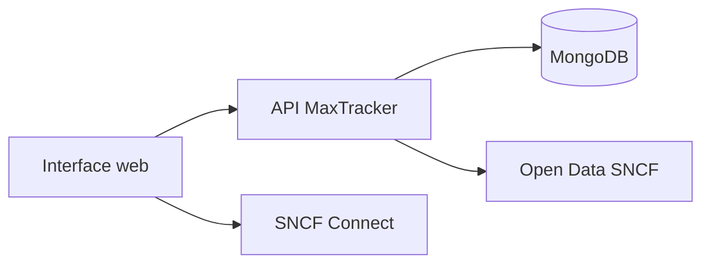

# MaxTracker

**Trouvez rapidement les trains TGV Max à 0 €** depuis votre gare de départ — TGV INOUI, Intercités et Intercités de nuit — sans parcourir destination par destination sur SNCF Connect.

MaxTracker est un service **indépendant et non officiel**. Il ne vend pas de billets et ne réserve pas à votre place : il vous montre les opportunités repérées dans les données ouvertes SNCF, puis vous redirige vers [SNCF Connect](https://www.sncf-connect.com) pour réserver.

---

## Sommaire

- [À quoi ça sert ?](#à-quoi-ça-sert-)
- [Comment l’utiliser](#comment-lutiliser)
- [Ce que vous pouvez faire](#ce-que-vous-pouvez-faire)
- [Bon à savoir](#bon-à-savoir)
- [Avertissement](#avertissement)
- [Pour les développeurs](#pour-les-développeurs)

---

## À quoi ça sert ?

Vous avez un abonnement **TGV Max** et vous cherchez un aller simple à **0 €** dans les **30 prochains jours**, sans passer des heures à chercher sur SNCF Connect.  
MaxTracker vous aide à trouver les trains **éligibles** à l'abonnement TGV Max, ce qui permet aux abonnés de voyager à 0 €.

Les données proviennent du jeu ouvert [« Disponibilités TGV Max »](https://data.sncf.com/explore/dataset/tgvmax/) publié par SNCF Voyageurs. 
Elles sont **mises à jour régulièrement**, tous les jours aux alentours de 6h30, donc pas en temps réel : voir [Bon à savoir](#bon-à-savoir).

MaxTracker est un service **indépendant et non officiel**.   
Il ne vend pas de billets et ne réserve pas à votre place : il vous montre les opportunités repérées dans les données ouvertes SNCF, puis vous **redirige** vers [SNCF Connect](https://www.sncf-connect.com) pour réserver.

## Comment l’utiliser

1. **Saisissez votre gare de départ** (au moins 3 lettres pour l’autocomplétion)
2. Lancez la recherche
3. Parcourez les résultats **par ville de destination**
4. Si besoin, affinez avec les **filtres** (week-end, matin / après-midi / soir, type de train)
5. Cliquez sur un train pour **vérifier et réserver sur SNCF Connect**

**Astuces**

- Vous pouvez **enregistrer vos gares favorites** pour y revenir vite (stockage local)
- **Masquer** une destination que vous ne voulez plus voir
- Passer en vue **Calendrier** pour voir combien de trains éligibles partent chaque jour
- Consulter le **graphique des heures** pour repérer les créneaux les plus fournis
- Le badge **« Départ imminent »** signale un départ dans moins de 4 heures
- L’heure affichée en haut indique la **dernière synchronisation** des données (à ne pas confondre avec l'heure de départ du train)

---

## Ce que vous pouvez faire

| Besoin | Dans l’app |
|--------|------------|
| Voir tous les départs à 0 € depuis une gare | Recherche par gare de départ |
| Comparer les destinations | Liste groupée par ville |
| Cibler le week-end ou un créneau | Filtres week-end et horaires |
| Ne garder que TGV INOUI ou Intercités | Filtres par type de train |
| Éviter les correspondances | Option « directs uniquement » |
| Planifier sur le mois | Vue calendrier |
| Repérer les meilleures heures | Graphique des heures de pointe |
| Réserver | Lien SNCF Connect sur chaque train |

Si **aucun train éligible** n’apparaît pour votre gare, l’app vous l’indique clairement : les places se libèrent souvent par vagues, réessayez plus tard.

Si la gare n’est **pas desservie** par l’offre TGV Max, un message d’erreur vous le signale.

---

## Bon à savoir 

- **Vérifiez toujours sur SNCF Connect** avant de vous déplacer. Un train éligible affiché ici peut avoir été réservé entre deux mises à jour.
- **Fenêtre de 30 jours** : seuls les départs dans les 30 prochains jours sont pertinents pour TGV Max (c’est aussi ce que l’app affiche).
- **Pas de réservation ici** : MaxTracker est un outil de repérage ; la vente et le paiement restent sur les canaux officiels SNCF.
- **Données par vagues** : la SNCF met à jour son open data environ toutes les heures ; MaxTracker resynchronise environ toutes les **15 minutes** quand le service tourne.
- **Service non officiel** : MaxTracker n’est pas affilié à la SNCF. Les marques citées appartiennent à leurs propriétaires respectifs.

---

## Avertissement

MaxTracker **n’est PAS affilié à la SNCF**. « SNCF », « TGV », « TGV Max », « MAX JEUNE », « MAX ACTIF » et « SNCF Connect » sont des marques déposées de leurs propriétaires respectifs.

Les données affichées proviennent du portail [data.sncf.com](https://data.sncf.com/explore/dataset/tgvmax/), sous la licence indiquée par le portail open data. L’application ne collecte pas d’identifiants SNCF Connect et n’effectue aucune transaction.

---

<details>
<summary><h2>Pour les développeurs</h2></summary>

### Démarrage local

**Prérequis :** Python 3.11, Node.js 18+, MongoDB (local ou Atlas).

```bash
# Backend
cd back
cp .env.example .env
# MONGO_URL, DB_NAME, CORS_ORIGINS=http://localhost:3000
python3 -m venv .venv && source .venv/bin/activate
pip install -r requirements.txt
uvicorn server:app --reload --port 8000

# Frontend (autre terminal)
cd front
npm install
npm start
```

- API : [http://localhost:8000/api/](http://localhost:8000/api/)
- App : [http://localhost:3000](http://localhost:3000)
- OpenAPI : [http://localhost:8000/docs](http://localhost:8000/docs)

Au premier lancement, une sync initiale peut prendre 1–2 min si la base est vide.

### Structure du dépôt

```
tgvmax-platform/
├── back/                          # API FastAPI
│   ├── server.py                  # Point d'entrée Uvicorn
│   ├── requirements.txt
│   ├── runtime.txt                # Version Python (Render)
│   ├── .env.example
│   ├── app/
│   │   ├── main.py                # Application FastAPI
│   │   ├── config.py
│   │   ├── api/
│   │   │   ├── router.py
│   │   │   └── routes/            # health, search, stations, sync
│   │   ├── core/                  # logging, rate limiting
│   │   ├── db/
│   │   │   ├── mongodb.py
│   │   │   └── repositories/      # trips, sync_state
│   │   ├── domain/                # stations, trips, train_classifier
│   │   ├── schemas/               # modèles Pydantic
│   │   └── services/
│   │       ├── search.py
│   │       ├── sync.py
│   │       └── sncf/              # client Open Data + SNCF Connect
│   └── tests/
├── front/                         # SPA React (CRA + Craco)
│   ├── public/
│   ├── src/
│   │   ├── App.js
│   │   ├── pages/Home.jsx
│   │   ├── components/            # SearchBar, TrainCard, CalendarView…
│   │   │   └── ui/                # composants Radix / shadcn
│   │   └── lib/                   # api, storage, tripTime, utils
│   └── package.json
├── doc/
│   ├── regles-de-gestion.md
│   └── contraintes.md
└── render.yaml                    # Blueprint Render (optionnel)
```

### Variables d’environnement

**Backend** (`back/.env`) :

| Variable | Obligatoire | Description |
|----------|-------------|-------------|
| `MONGO_URL` | Oui | URI MongoDB |
| `DB_NAME` | Oui | Nom de la base (ex. `ma_base_de_donnees`) |
| `CORS_ORIGINS` | Oui | Origines autorisées |

Optionnel : `sync_interval_min` (défaut `15`), `rate_limit_per_min` (défaut `10`).

**Frontend** (build) : `REACT_APP_BACKEND_URL` — URL du backend sans `/api`.

### API

Préfixe : `/api`

| Méthode | Route | Description |
|---------|-------|-------------|
| `GET` | `/` | Santé |
| `GET` | `/search?origin={gare}` | Trajets éligibles depuis une gare |
| `GET` | `/search?origin={gare}&fresh_prices=true` | Recherche + re-contrôle éligibilité SNCF |
| `GET` | `/stations/search?q={texte}` | Autocomplétion gares |
| `GET` | `/sync/info` | État de la synchronisation |
| `POST` | `/sync/trigger` | Sync manuelle (admin / cron) |


### Documentation technique

| Document | Contenu |
|----------|---------|
| [doc/regles-de-gestion.md](doc/regles-de-gestion.md) | Règles de gestion |
| [doc/contraintes.md](doc/contraintes.md) | Contraintes données, métier, légales |

### Stack

| Couche | Technologie |
|--------|-------------|
| Frontend | React 19, Tailwind CSS, Radix UI, Recharts |
| Backend | FastAPI, Uvicorn, Motor, APScheduler |
| Base | MongoDB |
| Source | [Open Data SNCF — tgvmax](https://data.sncf.com/explore/dataset/tgvmax/) |




### Licence

À définir selon la politique du dépôt. L’usage du jeu de données SNCF est soumis aux [conditions du portail open data](https://data.sncf.com/).

</details>
